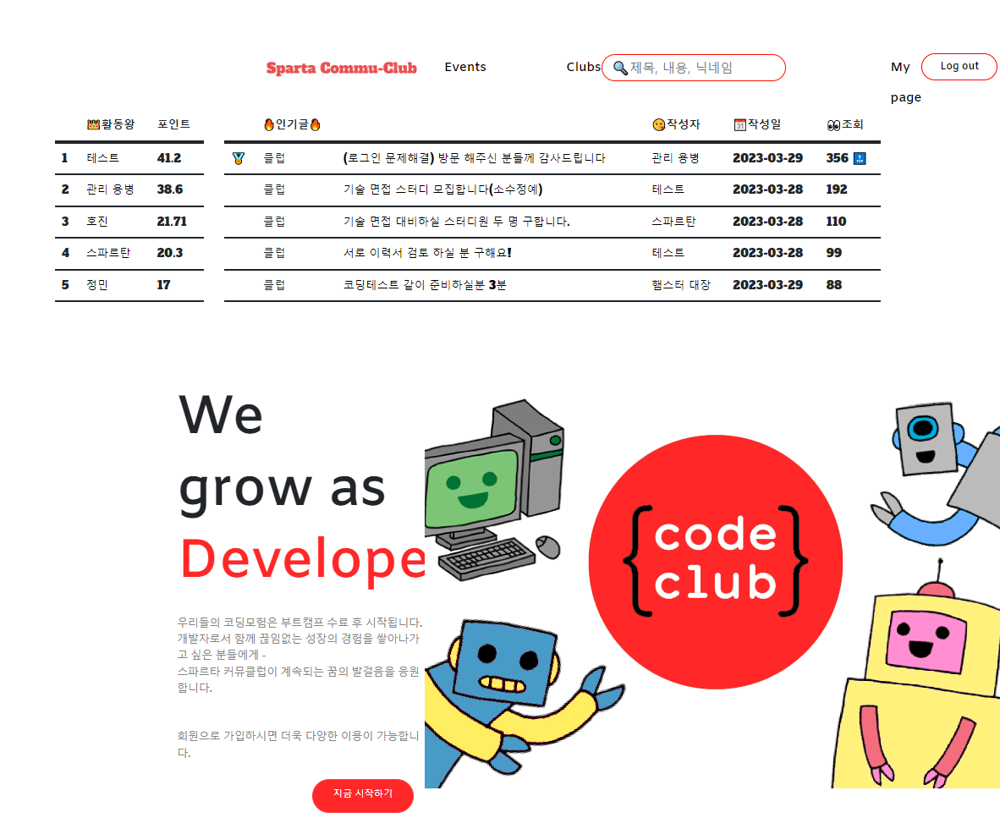
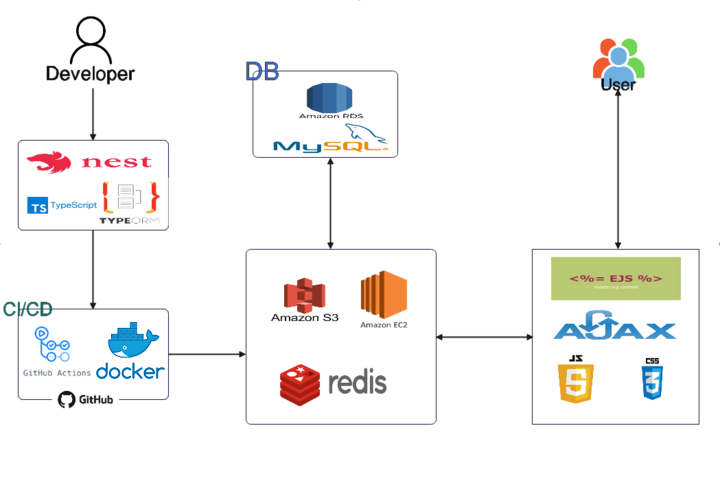

# 스파르타 커뮤클럽 (Sparta Commu-Club)

 
 
 

# 👉 프로젝트 소개

내일배움캠프, 항해99, {창} 등 스파르타코딩클럽의 교육과정을 수강한 수료생들이 교류하며, 
개발자로 성장하며 정체성과 역할을 만들어갈 수 있도록 서로를 돕는 커뮤니티 서비스를 제공합니다.

개발자 취업 및 이직 준비를 위한 스터디가 필요할 때 ❗  다양한 행사에 참여하고 싶을 때 ❗ 
스파르타 커뮤클럽에서 이루어보세요 ❗❗

 
 
 

# 🖥️서비스 화면

 

|                            메인페이지                            |                             클럽페이지                             |                          이벤트페이지                           |
| :--------------------------------------------------------------: | :----------------------------------------------------------------: | :-------------------------------------------------------------: |
|    |      |  |
|                           클럽 신청서                            |                            이벤트신청서                            |
|  |  |

 
 
 

# 기술 스택

## Front-end

     

## Back-end

   

## Database

  

## DevOps

   

## 협업툴

    
 
 
 

# 😀프로젝트 참여인원

- 김호진 Team Leader
- 변정민 Vice Leader
- 김재광 Team member
- 강하루 Team member
- 이승준 Team member

 
 
 

# ⚙️서비스 아키텍처

 
 
 

# ✍️기술적 의사결정

## Nest.js

- 객체지향의 원칙인 SOLID를 통해 코드를 모듈화하여 생산성 향상 및 유지보수 용이,

## TypeORM

- 별도의 패키지 설치나 처리 없이도 타입을 지정하는 타입스크립트와의 호환성이 좋고, 복잡한 모델간의 관계를 쉽게 형성할 수 있어 코드 생성과 유지 및 보수를 쉽게 처리할 수 있음

## 트렁크 기반 개발

- 작업중인 코드의 공유주기를 빠르게 하여 최종단계의 충돌을 최소화하고, 이슈 공유가 자연스러운 팀 문화를 조성하며, 지속 배포와 함께 사용하여 코드를 계속 릴리즈 가능한 상태에서 판단

## NodeMailer

- 메일 전송, 보안성 우수, HTML문서를 그대로 메일 내용으로서 사용할 수 있음

## Redis

- 리스트, 배열과 같은 데이터 처리의 유용성
- 메모리를 활용함과 동시에 데이터 보존
- 빠른 데이터 접근 속도

## Linear

- 비동기적 소통을 통한 프로젝트 일정관리 및 담당업무 진행도를 파악해, 동기적 소통으로 인한 부하 최소화

## Docker

- 컨테이너를 사용하여 프로젝트에 이식성과 일관성을 부여해, Github과 Amazon EC2에 연결해서 CI/CD 환경을 구축

 
 
 
